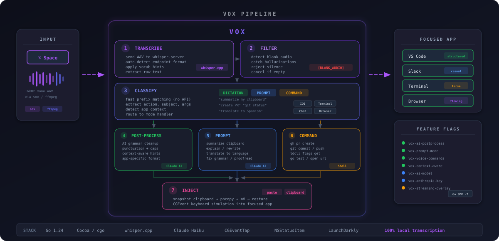

<p align="center">
  
</p>

<h1 align="center">VOX</h1>

<p align="center">
  <strong>Voice-Operated eXecution for macOS</strong>
</p>

<p align="center">
  System-wide speech-to-text that runs entirely locally. Hold a hotkey, speak, release — transcribed text appears wherever your cursor is.
</p>

<p align="center">
  <a href="https://github.com/mattthewong/vox/actions"></a>
  <a href="https://github.com/mattthewong/vox/releases"></a>
  
  
  
</p>

<p align="center">
  <a href="#install">Install</a> &bull;
  <a href="#how-it-works">How it works</a> &bull;
  <a href="#configuration">Configuration</a> &bull;
  <a href="#development">Development</a>
</p>

---

## What it does

Vox turns your voice into text in any application. The entire pipeline runs locally — no cloud services, no API keys required for core dictation.

**Hold** your hotkey, **speak** naturally, **release** — transcribed text is pasted at your cursor. Works in editors, browsers, terminals, chat apps, anywhere.

<p align="center">
  
</p>

## How it works

```
Hold hotkey → Record mic → Whisper transcribes → Classify → [AI Process] → Text pasted at cursor
```

<p align="center">
  
</p>

1. **Transcribe** — WAV audio is sent to a local [whisper.cpp](https://github.com/ggerganov/whisper.cpp) server. Auto-detects endpoint format, applies custom vocabulary hints.

2. **Filter** — Detects blank audio, whisper hallucinations (`[BLANK_AUDIO]`), and empty transcriptions. Cancels the pipeline early if there's nothing to process.

3. **Classify** — Fast prefix matching (no API call) routes the transcription into one of three modes:
   - **Dictation** — Normal speech-to-text (default)
   - **Prompt** — Voice-to-Claude shortcuts ("summarize my clipboard", "translate to Spanish", "explain this error")
   - **Command** — Shell execution via voice ("create PR", "git status", "query flag \<name\>")

4. **Post-process** *(Dictation)* — Optional AI cleanup via Claude for grammar, punctuation, and context-aware formatting based on the frontmost app (terse for terminals, conversational for chat).

5. **Prompt** *(Prompt mode)* — Sends the classified action to Claude with appropriate system prompts. Operates on clipboard contents or spoken subjects.

6. **Command** *(Command mode)* — Routes to a registry of shell commands: `gh`, `git`, `ldcli`, `go test`, `open`.

7. **Inject** — Snapshots the clipboard, writes text via `pbcopy`, simulates Cmd+V via CGEvent, then restores the original clipboard.

## Install

### Quick start (one command)

Requirements: **macOS** and **Homebrew**. Everything else (`go`, `sox`, `whisper-cpp`) is installed automatically.

```bash
git clone https://github.com/mattthewong/vox.git
cd vox
make start
```

`make start` handles everything:

1. Installs missing system deps (`go`, `sox`, `whisper-cpp`) via Homebrew
2. Downloads the default Whisper model (~150 MB) to `~/.local/share/whisper-cpp/`
3. Builds `bin/Vox.app` and ad-hoc codesigns it
4. Launches Vox detached — it manages `whisper-server` itself

The first launch triggers two macOS permission prompts (Microphone and Accessibility); grant both and you're done.

### Manual setup

```bash
brew install go sox whisper-cpp
mkdir -p ~/.local/share/whisper-cpp
curl -L -o ~/.local/share/whisper-cpp/ggml-base.en.bin \
  "https://huggingface.co/ggerganov/whisper.cpp/resolve/main/ggml-base.en.bin"
```

### Build

```bash
make build      # outputs bin/vox (bare binary)
make app        # outputs bin/Vox.app (macOS bundle, ad-hoc signed)
make install    # installs bin/vox to /usr/local/bin/vox
```

`make app` also copies the sherpa-onnx dylibs into `Contents/Frameworks`
(`packaging/bundle-dylibs.sh`). That is what makes Parakeet work on other
machines — and what takes the bundle from ~11 MiB to ~42 MiB. The binary does
not link these libraries; Parakeet dlopens them on first use, so whisper-only
sessions never load them and launch never depends on them. A bare `bin/vox`
from `make build` finds them in your local Go module cache instead.

### Lifecycle

```bash
make start    # ensures deps, builds, launches detached
make stop     # stops Vox (whisper child exits with it)
make status   # shows whether Vox is running
```

## macOS permissions

On first run, macOS prompts for two permissions. Grant them to **Vox** (`Vox.app` in System Settings):

- **Microphone** — System Settings > Privacy & Security > Microphone
- **Accessibility** — System Settings > Privacy & Security > Accessibility

The `.app` bundle uses a stable `CFBundleIdentifier` (`dev.vox.menubar`), so permissions survive rebuilds.

## Speech engines

Vox supports two local speech-to-text engines. Both run entirely on your
machine with no network calls.

| Engine | Model | Size | Notes |
|---|---|---|---|
| whisper | `tiny.en`, `base.en` (default), `small.en`, `medium.en`, `large-v3-turbo` | 75 MiB to 1.5 GiB | Runs via a local `whisper-server` process |
| parakeet | `parakeet-v2` (English), `parakeet-v3` (25 European languages) | ~460 MiB | Runs in-process; punctuates and capitalizes natively |

Pick one from the menubar under **Speech Model**, or set it explicitly:

```bash
# environment variable
VOX_STT_ENGINE=parakeet-v2 vox

# or ~/.vox/config.yaml
stt_engine: parakeet-v2
```

The value is either a catalog model ID (`parakeet-v2`, `small.en`) or a bare
engine name (`whisper`, `parakeet`); a bare engine name selects that engine's
default model. Anything unrecognized falls back to `base.en` rather than
failing startup.

Precedence is LaunchDarkly flag (`vox-stt-engine`), then `VOX_STT_ENGINE`,
then `~/.vox/config.yaml`, then the menubar selection, then `base.en`.

Models download on first use to `~/.local/share/vox/models/`. Whisper models
already present in `~/.local/share/whisper-cpp/` are detected and reused, so
upgrading does not re-download them.

If the selected engine fails to start, Vox falls back to `base.en` so
dictation keeps working, and reports the original failure.

### Benchmarking

Compare engines on your own audio before switching:

```bash
make bench-libri      # reproducible LibriSpeech subset
make bench-personal   # your own dictation recordings
```

See `bench/README.md`.

## Configuration

All via environment variables:

| Variable | Default | Description |
|----------|---------|-------------|
| `VOX_HOTKEY` | `option+space` | Hotkey to trigger recording. Comma-separated for multiple. |
| `VOX_STT_ENGINE` | `base.en` | Engine or model — see [Speech engines](#speech-engines) |
| `VOX_WHISPER_MODEL_ID` | *(unset)* | Deprecated alias for `VOX_STT_ENGINE`. Used only when `VOX_STT_ENGINE` is unset. |
| `VOX_HOLD_TO_TALK` | `true` | `true` = hold to record, `false` = toggle on/off |
| `VOX_LANGUAGE` | *(auto)* | BCP-47 language code (e.g. `en`, `es`) |
| `VOX_VERBOSE` | `false` | Debug logging |

Menubar toggles (mode, sounds, auto-paste, hotkey, model) persist to `~/Library/Application Support/Vox/preferences.json`. Env vars > preferences > defaults.

### Hotkey formats

```bash
VOX_HOTKEY="fn"                 # Fn / Globe key
VOX_HOTKEY="cmd+shift"          # Modifier-only
VOX_HOTKEY="option+space"       # Modifier + key
VOX_HOTKEY="ctrl+shift+d"       # Multiple modifiers + key
VOX_HOTKEY="fn,cmd+shift"       # Multiple hotkeys (either triggers)
```

**Modifiers:** `ctrl`, `shift`, `option`/`alt`, `cmd`/`command`
**Keys:** `a-z`, `0-9`, `f1-f20`, `space`, `return`, `escape`, `tab`, `delete`, arrow keys

## AI features

AI-powered features require an Anthropic API key. Set via `~/.vox/config.yaml`:

```yaml
anthropic_api_key: sk-ant-...
```

Or distribute keys to a team via LaunchDarkly feature flags:

| Flag | Controls |
|------|----------|
| `vox-ai-postprocess` | AI grammar/punctuation cleanup |
| `vox-prompt-mode` | Voice-to-Claude prompt shortcuts |
| `vox-voice-commands` | Shell command execution via voice |
| `vox-context-aware` | App-aware formatting hints |
| `vox-ai-model` | Which Claude model to use |
| `vox-anthropic-key` | Team-managed API key distribution |
| `vox-streaming-overlay` | Floating transcription overlay |

Flag precedence: LaunchDarkly > env var > config file > default.

## Architecture

```
cmd/vox/main.go          — Entrypoint, event loops, signal/menubar shutdown wiring
internal/hotkey/          — CGEventTap-based global hotkey (modifier-only, fn, modifier+key)
internal/audio/           — Mic recording via ffmpeg/sox subprocess
internal/transcribe/      — Transcriber interface + Whisper HTTP client (multipart upload, auto endpoint detection)
internal/parakeet/        — In-process Parakeet recognizer via sherpa-onnx (cgo, CPU-only)
internal/sttmodel/        — Speech model catalog: download, checksum, extract, install detection
internal/classify/        — Intent classifier (prefix matching → Dictation/Prompt/Command)
internal/claude/          — Anthropic Claude Messages API client
internal/prompt/          — Prompt mode executor (summarize, explain, rewrite, translate)
internal/commands/        — Voice command registry (gh, git, ldcli, go test, open)
internal/pipeline/        — Generic stage pipeline
internal/inject/          — Text injection (pbcopy + CGEvent Cmd+V + clipboard restore)
internal/ui/              — Menubar status item (Cocoa via cgo)
internal/config/          — Env var config + hotkey parsing
internal/flags/           — LaunchDarkly Go Server SDK v7 integration
internal/appctx/          — Frontmost app detection (NSWorkspace)
internal/format/          — Context-aware formatting hints per app category
```

**Threading:** The main goroutine owns NSApp's run loop. CGEventTap registers on the same loop, so menubar clicks and hotkey events are dispatched on the same thread. Recording, transcription, and injection run in goroutines.

## Development

```bash
make build        # Build bare binary (bin/vox)
make app          # Wrap into bin/Vox.app (ad-hoc codesigned)
make test         # Run all tests
make test-short   # Skip integration tests
make lint         # go vet
make fmt          # gofmt
make run          # Build and run
```

## Why

I was using Whisper Flow for speech-to-text but kept hitting rate limits on their free plan. Vox does the same thing — system-wide dictation with a hold-to-talk hotkey — but runs entirely on your machine with no external dependencies.

## License

MIT
